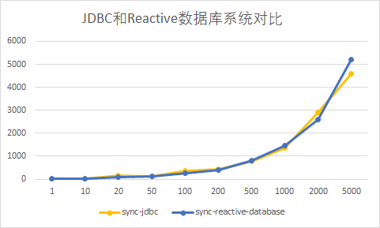

## 探究高并发和非阻塞IO下的文件数据存储和数据库存储 
### 1.Explore file data storage and database storage under high concurrency and non-blocking IO

11811712 江川

### 2.Introduce

本实验目的是比较文件储存数据和使用数据库储存数据这两种方式的性能差异，同时试图比较在高并发的情况下对应的情况。另外尝试使用异步文件IO和异步数据库IO提升数据检索性能。

### 3. Experimental design

#### 3.1 Experimental data and environments

本次实验采用 [2019 新型冠状病毒疫情时间序列数据仓库](https://github.com/BlankerL/DXY-COVID-19-Data) ，并进行了简单的预处理。

对于文件存储系统，采用类似CSV的无title格式储存数据，其中的数据格式如下：

```plain
33450,宜昌,Yichang,420500.0,711,0,36,8,2020-02-09 18:15:44
33451,荆门,Jingmen,420800.0,663,0,48,19,2020-02-09 18:15:44
```

为了方便文件储存的解析，过滤了原数据中含有字符串存在逗号的行，并且剔除了部分直辖市的数据。

对于数据库系统，采用 PostgreSQL 12 储存数据，使用如下 Table 存储数据。

```sql
DROP TABLE IF EXISTS city;
CREATE TABLE city
(
    id             SERIAL,
    name           VARCHAR(10) NOT NULL,
    englishName    VARCHAR(70) NOT NULL,
    zipCode        VARCHAR(10) NOT NULL,
    confirmedCount INT         NOT NULL,
    suspectedCount INT         NOT NULL,
    curedCount     INT         NOT NULL,
    deadCount      INT         NOT NULL,
    updateTime     TIMESTAMP   NOT NULL,
    PRIMARY KEY (id)
);
```

(不要纠结这个表设计不太符合范式的问题，做文件系统的跨表查询过于麻烦，因此数据库的表也简化设计)

经过预处理后，留下了 **54592** 条相关的数据，数据文件大小约为 3.3KB。

#### 3.2 Architecture of experimental platform

实验平台采用 vert.x 提供的异步IO、`EventBus` 等工具，来模拟用户通过网络访问数据服务的情况。

对于数据层 ，提供 `DataService` 接口，各种数据储存都需要实现这个接口，这个接口的定义如下

```kotlin
interface DataService {
    
    suspend fun init()

    suspend fun insert(cityData: JsonObject)

    suspend fun lastData(): JsonArray

    suspend fun cityData(name: String): JsonArray

    suspend fun select(id: Int): JsonObject

}
```

对于模拟的用户层，定义了 `Visitor` 接口，`Visitor` 可以向 `EventBus` 中发送请求数据的事件。

在用户层和模拟层之间，实现了一个 `DataServiceVerticle` ，该类采用了 vert.x 事件循环的机制，能通过 `EventBus` 收到请求数据的事件，并且调用对应的 `DataService` 方法返回请求数据。这个中间层主要是为了实现用户层和数据层的解耦，通过 `EventBus` 模拟网络异步请求数据的行为，并且确保每个不同的 `DataService` 运行在独立的线程中，不会在测试时相互干扰。

#### 3.3 Experiments

##### 3.3.1.阻塞文件存储系统和 JDBC实现的数据库存储系统

首先实现 `BlockingFileDataService` ， ==(bonus)== 使用 `bufferedReader` 按行读取数据，只需要对关注的行进行解析处理，对于不关注的直接丢弃，这种做法应该能实现对大文件的处理，不用完全加载进内存。

然后实现 `JDBCDatabaseService` ，使用 JDBC 读取 PostgreSQL 数据库。

编写 `SyncVisitor` ，这个 Visitor 会同步访问数据存储系统，所有的请求数据行为会串行执行，只有前一个请求的数据返回了，才会开始下一个请求。

使用  `SyncVisitor`  分别对两个系统请求 1, 10, 20, 50, 100, 200, 500, 1000, 2000, 5000  次，执行三次这样的操作，并对结果进行平均值处理，得到的时间分布情况如下。其中横坐标为请求数据的次数，纵坐标为完成全部请求花费的时间(毫秒)。


可以发现，数据库系统的处理时间远远小于阻塞的文件IO的处理时间。在请求次数到达一定数量后，数据库对每个请求平均花费时间约为文件系统的 50 分之一。

##### 3.3.2 异步文件IO存储系统 ==(bonus)==

对于这个测评系统的性能分析，我认为这个系统是 IO 密集型的，主要的性能瓶颈在文件的 IO 读取上。众所周知的是，使用传统的阻塞 IO 会使得线程被阻塞，运行被中断，而这对于提高系统的低延迟、高吞吐量等性能来说是不利的。本次实验平台使用的 vert.x 框架是一开始就考虑到了这点，vert.x 采用的是 EventLoop 的模式，天然支持异步 IO，我认为将阻塞的文件 IO 改成异步文件 IO 能大幅度提高本系统的性能。

基于这一点考虑，我接下来实现了 `AsyncFileDataService` ，它使用了 vert.x 关于文件系统的异步API，使用 Buffer 来分段加载数据，对需要的行进行处理（与`BlockingFileDataService` 同一个 bonus），取余直接丢弃。

实现后，通过同样的方式，对比 `AsyncFileDataService` 和 `BlockingFileDataService` 进行测试，得到三组数据取平均值制得下图。


然后比较悲惨的发现，实现的异步文件IO系统比阻塞文件IO更慢。关于这点的原因可能是我对实现异步IO不太熟悉，也有可能是因为异步文件IO只有在高并发，或者读取多个文件等情况下才更具优势。

##### 3.3.3 交互式数据库存储系统 (==bonus==)

除了对文件系统实现异步IO，我考虑到数据库也可能通过异步IO提高性能。（又）总所周知的是，JDBC 是一个阻塞的数据库 IO 框架。Java团队在设计 JDBC 标准之初，异步 IO 并没有得到重视。在今天看来，JDBC这样一个陈旧的标准，或许制约着 Java 应用的性能，在 Web 服务器、文件系统、缓存 等领域都纷纷出现异步 IO 提高性能的时候，作为底层的数据库却仍只能使用阻塞IO的 JDBC。[Reference](https://www.zhihu.com/question/23084473/answer/334920663)

为了尝试解决这个问题，我使用 `Reactive PostgreSQL Client` 来代替 JDBC 进行相关的操作。`Reactive PostgreSQL Client` 是通过对 PostgreSQL API 进行封装，来提供 Reactive 能力的一套访问 PostgreSQL 数据库的库。因此，我编写了 `ReactiveDatabaseService` ，基于同样的测试对比其和  `JDBCDatabaseService` 的性能差异，得到的结果如下。



果然别人写的异步就是比我写的好，起码这个结果不是异步更慢。但是为啥没有更快呢，这个问题经过分析以后，我认为是由于 vert.x 对 JDBC 支持默认就带了线程池和连接池，封装了对 JDBC 的一些优化。这导致多线程下运行的 JDBC 和单线程异步的数据库查询在性能上没有显著差异。

##### 3.3.4 高并发状态下的各个系统性能情况 (==bonus==)

由于 异步文件 IO 和异步数据库都没有取得显著的好效果，我尝试在高并发的情况下对各个系统进行相应的测试，异步IO或许能取得更好的成绩。

为此，我编写了 `ConcurrentVisitor` ，这个 Visitor 的不同之处在于它模拟多个用户同时访问。随后，使用 `ConcurrentVisitor`  模拟 50 个用户同时请求数据存储系统，直到完成一定数量的任务，测试各个系统的性能。

以下是文件系统在同步和并发情况下的对比：


以下是数据库系统在同步和并发情况下的对比：


由图可得，在高并发的情况下，文件储存系统的性能并没有发生较大的改变，完成一定数量查询的时间波动不大。但是数据库存储系统的性能却有显著的提升，尤其的 JDBC 的性能提升最为显著。数据库系统能比较好的支持多用户，在高并发情况下能更好的完成数据请求，这个有点是文件系统不具备的。

当然，在并发的情况下，总任务的完成时间并不是唯一需要注重的要求，其他指标（如每个用户平均的相应时间）也可以作为评价性能的标准。另外，调整并发的用户数量，或许结果都有不同，完整地评价系统性能较为困难。

#### 3.4 Experimental results

以上所有测试得到的完整测试数据如下：


另外，也可以通过访问这个项目的  [github](https://github.com/Gogomoe/SUSTech_CS307_works/tree/master/Project1) 网址获取代码、测试数据等详细信息。

当前无法访问是因为怕公开项目后就被抄袭了，我就要背上 plagiarism 的罪名了。

### 4. Conclusions

综上所述，使用 DBMS 进行数据管理有非常大的优势。它比使用文件储存管理数据会快很多，有更低的响应时间。同时，DBMS还支持并发的数据管理，能利用并发加快一些任务的效率。在这次实验中，由于文件系统的事务管理难以实现，因此没有设计对应的测试，但是事务也是数据库很重要的一大特性。